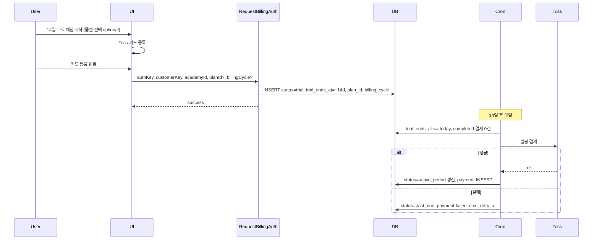

# 14일 무료 체험 구현 계획 (카드 등록 → 즉시 체험)

> 목표: 일반 플랫폼처럼 **카드 등록 후 바로 14일 프리 트라이얼**이 시작되도록 구현한다.

---

## 원하는 플로우

1. 사용자가 "14일 무료 체험 시작" 클릭 → 토스 카드 등록 창
2. **카드 등록 성공 시점에 바로** `status: 'trial'`, `trial_ends_at: 오늘 + 14일` 로 구독 행 생성 (별도 "구독 시작" 버튼 없음)
3. 체험 기간 중에는 정상 이용, 14일 후 Cron이 첫 결제 시도 → 성공 시 `active`, 실패 시 `past_due` 등

즉, **`card_only` 상태를 거치지 않고**, 신규 카드 등록 = 체험 시작이다.

---

## 구현 요약

| 구분 | 내용 |
|------|------|
| **request-billing-auth** | 신규 구독 행 생성 시 `status: 'trial'`, `trial_ends_at = 오늘 + 14일`, 기본 플랜(starter 월간) 또는 요청 시 넘긴 planId/billingCycle 저장. `card_only` 생성 제거. |
| **상수** | `TRIAL_DAYS = 14`, `getTrialEndsAt()` (lib/billing/constants.ts) |
| **Cron (auto-charge)** | trial 만료일 도래 구독에 대해 **첫 결제 시도** → 성공 시 active + 기간 갱신, 실패 시 past_due + 재시도. (기존은 만료 시 expired만 설정) |
| **subscribe API** | 체험 중 사용자가 "지금 결제하고 정식 구독" 선택 시 사용(즉시 결제 → active). 신규 카드만 등록한 뒤의 "구독 시작" 호출은 없어짐. |
| **프론트** | "14일 무료 체험 시작" = 카드 등록만 유도. 플랜/주기는 카드 등록 시 쿼리 또는 body로 넘기면 request-billing-auth에서 trial 플랜으로 저장. |

---

## 상세 구현

### 1. 상수 (신규)

- **파일**: `lib/billing/constants.ts`
- **내용**: `TRIAL_DAYS = 14`, `getTrialEndsAt(): string` (오늘 + 14일, DATE 문자열 `YYYY-MM-DD`).

### 2. request-billing-auth 수정 ([app/api/billing/request-billing-auth/route.ts](app/api/billing/request-billing-auth/route.ts))

- **body**: 기존 `authKey`, `customerKey`, `academyId` 유지. **추가(선택)**: `planId`, `billingCycle` (카드 등록 시 선택한 플랜 반영용).
- **기존 구독이 있을 때**: 변경 없음. 카드/빌링키만 갱신.
- **신규 구독 생성 시 (else 분기)**:
  - `status: 'card_only'` 대신 **`status: 'trial'`**
  - **`trial_ends_at`**: `getTrialEndsAt()` (오늘 + 14일)
  - **`plan_id`**: body.planId ?? `'starter'`
  - **`billing_cycle`**: body.billingCycle ?? `'monthly'`
  - **`current_period_start`**, **`current_period_end`**: 체험 기간(오늘 ~ trial_ends_at)으로 설정해 권한/표시 일관성 유지
  - 나머지: `toss_customer_key`, `toss_billing_key`, `card_company`, `card_number_masked` 등 기존과 동일

### 3. Cron auto-charge 수정 ([app/api/cron/auto-charge/route.ts](app/api/cron/auto-charge/route.ts))

- **trial 만료 처리** (기존: `status = 'expired'`만 설정):
  - **변경**: `status = 'trial'` 이고 `trial_ends_at <= today` 인 구독에 대해 **첫 결제 시도**:
    - 금액 계산: 해당 구독의 plan_id, billing_cycle, billing_plans 기준 + first_month_free 등 (기존 로직과 동일)
    - 토스 빌링 결제 호출
    - **성공**: `status: 'active'`, `current_period_start`/`current_period_end` 갱신, `subscription_payments` INSERT (completed)
    - **실패**: `status: 'past_due'`, `grace_period_end` 설정, `subscription_payments` INSERT (failed, next_retry_at). 기존 past_due 재시도 로직 활용
  - 첫 결제 대상 판별: 해당 구독의 `subscription_payments` 중 `status='completed'` 건이 0개인 경우만 (갱신이 아닌 첫 결제).

### 4. Subscribe API ([app/api/billing/subscribe/route.ts](app/api/billing/subscribe/route.ts))

- **역할**: 체험 중(trial) 사용자가 "지금 결제하고 정식 구독" 할 때만 사용. 즉시 결제 후 `active` 전환.
- **현재**: card_only 또는 trial에서 "구독 시작" 시 호출되어 즉시 결제 → active. 이 동작은 **trial → 즉시 결제** 시 그대로 유지.
- **card_only**: 신규 플로우에서는 카드 등록 시 바로 trial로 가므로 card_only는 기존 데이터 호환용으로만 남김. (선택) card_only인 경우 subscribe 시 trial로 바꿀지, 즉시 결제만 할지는 정책에 따라 결정. 권장: card_only도 subscribe 호출 시 즉시 결제(현재 동작 유지).

### 5. 프론트엔드

- **빌링 진입점**: "14일 무료 체험 시작" 클릭 시 → 플랜/주기 선택 가능하게 한 뒤(또는 기본값) → 토스 카드 등록 창 오픈. 등록 완료 시 `request-billing-auth` 호출 시 **planId, billingCycle** 전달(선택). 그러면 카드 등록 성공 = 해당 플랜으로 14일 체험 시작.
- **billing-view / plan-cards-section**: 구독 없을 때 "14일 무료 체험 시작" → 카드 등록 플로우만 연결. 카드 등록 콜백에서 planId/billingCycle 넘기도록 `openCardRegistration({ planId, cycle })` 등 활용. request-billing-auth에서 이 값을 받아 trial의 plan_id, billing_cycle으로 저장.
- **체험 중(trial)**: 현재처럼 현재 플랜 카드에 "체험 종료일", "체험 종료 시 자동 결제" 안내. "지금 결제하고 정식 구독" 버튼이 있으면 subscribe 호출(즉시 결제).

### 6. (선택) 학원당 1회 체험

- 해당 학원에 대해 이미 `subscription_payments`에 completed가 있으면, 카드 등록 시 trial 대신 즉시 결제만 허용하거나, trial_ends_at 없이 active로 시작. 구현 시 request-billing-auth에서 해당 academy_id로 completed 건 수 조회해 0이면 trial, 1 이상이면 정책에 따라 처리.

### 7. 문서

- [docs/billing_scenario.md](docs/billing_scenario.md): "카드 등록 후 14일 무료 체험" 절 추가. 플로우(카드 등록 = 체험 시작 → 14일 후 Cron 첫 결제), request-billing-auth 동작, Cron trial 만료 시 첫 결제 정리.

---

## 플로우 다이어그램

---

## 수정/추가 파일 목록

| 구분 | 파일 |
|------|------|
| 신규 | `lib/billing/constants.ts` |
| 수정 | `app/api/billing/request-billing-auth/route.ts` (신규 시 trial + trial_ends_at + 기간) |
| 수정 | `app/api/cron/auto-charge/route.ts` (trial 만료 시 첫 결제) |
| 수정 | `app/academy-admin/.../billing-view.tsx` (카드 등록 시 planId/billingCycle 전달) |
| 수정 | `lib/billing/use-toss-billing-auth.ts` 등 카드 등록 호출부 (planId/cycle 전달 가능 여부) |
| 문서 | `docs/billing_scenario.md` (14일 체험 플로우 절) |

subscribe API는 "체험 중 → 지금 결제" 용도로만 쓰이므로, 기존 즉시 결제 로직 유지하면 됨. `startWithTrial` 분기는 이 플로우에서는 불필요(카드 등록 시점에 이미 trial로 시작하므로).
