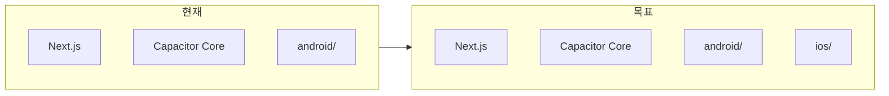

# Capacitor iOS 플랫폼 추가 계획

**개요**: 이미 구성된 Android와 동일한 Capacitor 8 설정을 바탕으로 iOS 플랫폼을 추가하고, 푸시·설정·빌드까지 한 번에 진행할 수 있는 단계별 계획입니다.

---

## 현재 상태

- **Android**: 이미 추가됨 (`android/` 존재, `cap sync` 완료).
- **iOS**: `ios/` 폴더 없음, `@capacitor/ios` 패키지 미설치.
- `capacitor.config.ts`에는 이미 `ios` 블록이 있음 (`contentInset`, `preferredContentMode`).
- `lib/capacitor/platform.ts` 등 앱 코드는 이미 `ios` 플랫폼을 감지·분기 처리 중.



---

## 1. 의존성 추가

- **작업**: `@capacitor/ios` 패키지 설치 (Android와 동일한 8.x 대).
- **이유**: `package.json`에는 `@capacitor/android`만 있고 `@capacitor/ios`가 없음. iOS 네이티브 프로젝트는 이 패키지의 템플릿을 기준으로 생성됨.

```bash
npm install @capacitor/ios@^8.1.0
```

---

## 2. iOS 플랫폼 추가

- **작업**: `npx cap add ios` 실행.
- **결과**: 프로젝트 루트에 `ios/` 폴더 생성 (Xcode 프로젝트, App 타겟, Info.plist, Podfile 또는 SPM 설정 등).
- **참고**: Capacitor 8은 새 iOS 프로젝트에 **Swift Package Manager(SPM)** 를 기본으로 사용. CocoaPods를 쓰려면 `--packagemanager Cocoapods` 옵션 지정.

```bash
npx cap add ios
# 또는 CocoaPods 사용 시: npx cap add ios --packagemanager Cocoapods
```

---

## 3. 동기화 및 설정 반영

- **작업**: `npx cap sync ios` 실행.
- **효과**:
  - `capacitor.config.ts` 내용이 `ios/App/App/capacitor.config.json` 등으로 복사됨.
  - 사용 중인 Capacitor 플러그인(app, push-notifications, splash-screen, status-bar)이 iOS 네이티브 쪽에 등록됨.
- **웹 에셋**: 현재처럼 `server.url`로 Live Reload를 쓰므로 `webDir`이 없어도 동작에는 문제 없음 (Android와 동일). 필요 시 나중에 `webDir`만 추가하면 됨.

---

## 4. iOS 전용 설정 정리

| 항목 | 내용 |
|------|------|
| **Bundle ID** | `capacitor.config.ts`의 `appId`(`com.moveit.app`)와 동일하게 유지. Xcode에서도 동일하게 설정. |
| **푸시 알림** | Apple Developer에서 APNs 키/인증서 설정 후, Firebase 콘솔에 iOS 앱 등록 → `GoogleService-Info.plist` 다운로드하여 `ios/App/App/`에 배치. 이미 `.gitignore`에 `ios/App/App/GoogleService-Info.plist`가 있음. |
| **Xcode Capabilities** | Xcode에서 타겟 → Signing & Capabilities에 **Push Notifications** 추가. |
| **Info.plist 권한** | 푸시는 플러그인으로 요청. 카메라/갤러리 등 추가 권한을 앱에서 사용한다면 해당 사용 목적 설명 키 추가 (예: `NSCameraUsageDescription`). |

설정 파일은 `cap add ios` / `cap sync` 이후 생성·갱신되므로, 위 항목은 **Xcode에서 열어서** 최종 확인·수정하는 것이 안전함.

---

## 5. 빌드 및 실행

- **환경**: **macOS + Xcode** 필요 (iOS 빌드는 Mac에서만 가능).
- **열기**: `npx cap open ios` 로 Xcode에서 `ios/App/App.xcworkspace`(CocoaPods 사용 시) 또는 `.xcodeproj`(SPM 사용 시) 열기.
- **서명**: Xcode에서 팀(Team) 선택, Bundle ID `com.moveit.app` 일치 여부 확인.
- **실행**: 시뮬레이터 또는 실제 기기 선택 후 Run.

---

## 6. 체크리스트 (실행 순서)

1. `@capacitor/ios@^8.1.0` 설치
2. `npx cap add ios` 실행 → `ios/` 생성 확인
3. `npx cap sync ios` 실행 → 설정·플러그인 반영 확인
4. (선택) `ios/App/App/` 아래에 `GoogleService-Info.plist` 배치
5. `npx cap open ios` 로 Xcode에서 팀/서명/Capabilities 설정
6. 시뮬레이터 또는 실기기에서 앱 실행 및 `server.url` 로드 확인

---

## 요약

- **코드/설정 변경**: `package.json`에 `@capacitor/ios` 추가와 `cap add ios` / `cap sync ios` 실행이 핵심이며, `capacitor.config.ts`의 기존 `ios` 설정은 그대로 활용 가능.
- **플랫폼 감지·푸시 등**: 이미 `ios`를 지원하므로 별도 코드 수정 없이, iOS 빌드만 추가하면 됨.
- **푸시 완전 연동**: APNs + Firebase + `GoogleService-Info.plist` + Xcode Push Notifications capability 설정이 추가로 필요함.
