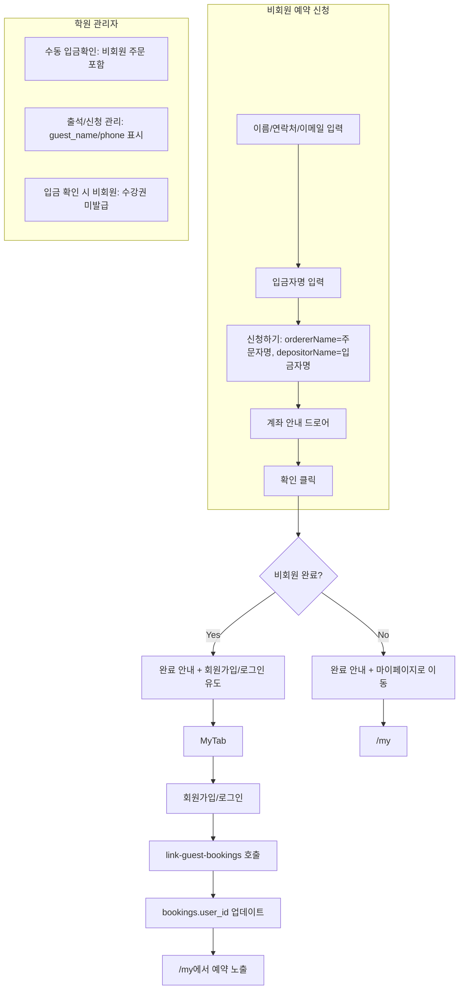

# 비회원 계좌이체 예약 정상화 및 완료 후 회원가입/매핑 (상세 계획)

## 1. 현재 구조 정리

### 1.1 DB·API

- **bank_transfer_orders**: `user_id` nullable. 비회원 주문은 `user_id = null`, `orderer_name` / `orderer_phone` / `orderer_email` 저장.
- **bookings**: `user_id` nullable. 비회원 예약은 `user_id = null`, `guest_name`, `guest_phone` 저장. `guest_email` 컬럼은 없음.
- **GET /api/bookings**: `user_id = user.id` 조건만 사용 → 비회원 예약( user_id null )은 /my에 절대 노출되지 않음.
- **POST /api/tickets/bank-transfer-order**: 비회원 시 `ordererName`(주문자 이름), `ordererPhone` 또는 `ordererEmail`(하나 필수), `depositorName`(선택) 기대. 주문·예약 생성 시 `user_id` null, `orderer_*` / `guest_name`, `guest_phone` 저장.

### 1.2 학원 관리자 쪽

- **수동 입금확인** ([app/api/academy-admin/[academyId]/bank-transfer-orders/route.ts](app/api/academy-admin/[academyId]/bank-transfer-orders/route.ts)): `academy_id` 기준 조회만 하므로 **비회원 주문도 이미 목록에 포함**됨. `orderer_name`, `orderer_phone`, `orderer_email`로 표시 가능.
- **출석/신청 관리** (enrollments): 학원 클래스별 `bookings` 조회, `user_id` 조건 없음 → **비회원 예약 포함**. [enrollments-view.tsx](app/academy-admin/components/views/enrollments-view.tsx)에서 이미 `guest_name`, `guest_phone` 검색·표시 (`users.name` 없을 때 `enrollment.guest_name` 사용).
- **입금 확인** ([bank-transfer-confirm/route.ts](app/api/academy-admin/[academyId]/bank-transfer-confirm/route.ts)): `user_id` null이면 주문만 CONFIRMED, 해당 booking은 CONFIRMED로 변경. **수강권(user_tickets)은 발급하지 않음** (비회원이므로). 응답 메시지: "주문자 연락처로 수강권 수령 방법을 안내해 주세요."

### 1.3 프론트 이슈

- **submitBankTransferOrder** 호출 시 비회원인데 **주문자 이름**(guestOrderer.name)과 **입금자명**(depositorName)을 구분해 보내지 않음. 현재는 입금자명만 `ordererName`으로 보내고 있어 API 규격과 불일치 가능.
- 계좌 안내 확인 후 완료 화면이 **비회원/회원 구분 없이** "마이페이지로 이동"만 노출. 비회원은 예약 현황 확인을 위해 회원가입/로그인 유도 필요.

---

## 2. 구현 계획 (디테일)

### 2.1 비회원 예약 신청이 API 규격에 맞게 동작

**파일**: [app/(main)/book/session/[sessionId]/page.tsx](app/(main)/book/session/[sessionId]/page.tsx)

- **목표**: 비회원일 때 API에 `ordererName`(주문자 이름), `ordererPhone`, `ordererEmail`, `depositorName`(입금자명)을 구분해 전달.
- **방법**:
  - `submitBankTransferOrder(guestName, guestPhone, guestEmail, depositorName?)` 형태로 확장.
  - 비회원: body에 `ordererName: guestOrderer.name`, `ordererPhone`, `ordererEmail`, `depositorName: depositorName`(모달 입력값) 전달.
  - 회원: 기존처럼 `ordererName`(입금자명/프로필), 필요 시 `depositorName`만 추가해 전달.
- **호출부**: 입금자명 모달 "신청하기"에서 비회원이면 `submitBankTransferOrder(guestOrderer.name, guestOrderer.phone, guestOrderer.email, depositorName)` 호출.

### 2.2 계좌 안내 확인 후 완료 화면 — 비회원일 때 회원가입/로그인 유도

**파일**: 동일 [page.tsx](app/(main)/book/session/[sessionId]/page.tsx)

- **상태**: `bankTransferCompletedAsGuest` 추가. `submitBankTransferOrder` 성공 시 `isGuest`일 때만 `true`로 설정(예: `setBankTransferResult` 직후). 드로어/완료 모달을 닫을 때 초기화.
- **완료 안내 UI** (`showBankTransferSuccessThenRedirect === true`):
  - 공통: "예약이 완료되었습니다. 학원에서 입금이 확인되면 예약이 확정됩니다."
  - **비회원** (`bankTransferCompletedAsGuest`):
    - 추가 문구: "예약 현황을 확인하려면 회원가입 또는 로그인해 주세요."
    - 버튼: "회원가입" / "로그인" → 클릭 시 완료 모달 닫고 `MyTab` 열기 (`setAuthModalInitialTab('signup'|'login')`, `setIsAuthModalOpen(true)`).
    - (선택) "닫기"로 모달만 닫고 현재 페이지 유지.
  - **회원**: 기존처럼 "마이페이지로 이동" 버튼만, 클릭 시 `/my` 이동.

### 2.3 비회원 예약 후 회원가입 시 /my에서 매핑

**목표**: 같은 연락처(또는 이메일)로 가입한 사용자가 /my(예약 목록)에서 비회원 시절 예약을 볼 수 있게 함.

**선택지**:

- **A. 회원가입/로그인 시점에 “비회원 예약 연결”**
  - 로그인/회원가입 성공 직후(또는 /my 최초 진입 시) 한 번만 실행:
    - `bookings`: `user_id IS NULL AND guest_phone = user.phone` 인 행에 `user_id = user.id` 업데이트.
    - (선택) `bank_transfer_orders`: `user_id IS NULL AND (orderer_phone = user.phone OR orderer_email = user.email)` 인 행에 `user_id = user.id` 업데이트 — 데이터 일관성용.
  - 구현: 새 API 예) `POST /api/me/link-guest-bookings` (로그인 필수). 클라이언트는 로그인/회원가입 성공 후 또는 /my 진입 시 1회 호출. 서버에서 위 조건으로 `bookings`(및 선택적으로 `bank_transfer_orders`) 업데이트.
- **B. GET /api/bookings 확장**
  - 조건을 `user_id = user.id OR (user_id IS NULL AND guest_phone = user.phone)` 로 변경해, 별도 업데이트 없이 “내 예약”에 비회원 예약 포함.
  - 장점: 구현 단순. 단점: 동일 연락처 타인 예약이 섞일 수 있음. 개인정보 민감도에 따라 선택.

**권장**: **A** 방식. 연락처 일치 시 해당 예약을 “내 계정”으로 확정해서 보여 주는 쪽이 예측 가능하고, 나중에 수강권·알림 연동도 일관되게 가져가기 좋음.

**추가 고려**:

- `bookings`에는 `guest_email`이 없음. 매핑은 **guest_phone ↔ user.phone** 기준으로 수행. 이메일 매핑을 원하면 `bookings`에 `guest_email` 컬럼 추가 후, bank-transfer-order 생성·입금 확인 플로우에서 저장하고, linking 시 `guest_phone OR guest_email` 조건 사용 가능.
- 수강권: 비회원 주문은 입금 확인 시 수강권이 발급되지 않음. 회원가입 후 예약만 매핑하면 “예약”은 /my에 보이지만 “수강권”은 없음. 필요 시 학원 측에 "수강권 수령 방법 안내" 또는 별도 수강권 발급 절차 유지.

### 2.4 학원 관리자 신청 목록·수동 입금확인에서 비회원 처리

**이미 동작하는 부분**:

- **수동 입금확인**: `academy_id` 기준이라 비회원 주문 포함. `orderer_name`, `orderer_phone`, `orderer_email`로 표시·검색 가능.
- **출석/신청 관리**: 클래스별 bookings 조회에 `user_id` 제한 없음. 비회원 예약 포함, `guest_name`, `guest_phone` 검색·표시됨.

**보완(선택)**:

- 수동 입금확인 목록에서 `user_id`가 null인 행에 **"비회원"** 뱃지(또는 아이콘) 표시 → 관리자가 수강권 발급 없이 “입금 확인만” 처리하는 경우를 인지하기 쉽게 함.
- 입금 확인 후 비회원 주문에 대한 응답 메시지는 현재대로 유지: "주문자 연락처로 수강권 수령 방법을 안내해 주세요."

### 2.5 비회원 입금 확인 시 수강권 미발급 — 정리

- 현재: 비회원 주문은 입금 확인 시 `bank_transfer_orders`만 CONFIRMED, 연결된 `bookings`는 CONFIRMED로 변경. `user_tickets`(수강권)는 생성하지 않음.
- 회원가입 후 매핑 시: `bookings.user_id`만 갱신하면 /my 예약 목록에는 나타남. 수강권은 그대로 없음. 필요 시 “수강권은 학원에 문의” 등 안내 문구를 회원가입 유도 화면이나 /my에 노출할 수 있음.

---

## 3. 수정 대상 파일 요약

| 구분 | 파일 | 변경 내용 |
|------|------|-----------|
| 프론트 | [app/(main)/book/session/[sessionId]/page.tsx](app/(main)/book/session/[sessionId]/page.tsx) | ① 비회원 시 ordererName/depositorName 구분 전달 ② bankTransferCompletedAsGuest 상태 및 완료 안내 분기(비회원 시 회원가입/로그인 버튼, MyTab 연동) |
| API | [app/api/bookings/route.ts](app/api/bookings/route.ts) | 변경 없음 (매핑 방식 A일 때). 방식 B일 때만 GET 조건 확장 |
| 신규 API | `app/api/me/link-guest-bookings/route.ts` (또는 auth 콜백 내 처리) | 로그인 사용자에 대해 `guest_phone = user.phone` 인 booking의 `user_id` 업데이트 (및 선택적으로 bank_transfer_orders) |
| 클라이언트 | 로그인/회원가입 성공 후 또는 MyPageView 진입 시 | link-guest-bookings 1회 호출 (중복 호출 방지 플래그 또는 서버에서 “이미 연결된 건” 스킵) |
| 학원 admin (선택) | [deposit-confirm-view 또는 bank-transfer-orders API 응답 가공](app/academy-admin/components/views/deposit-confirm-view.tsx) | `user_id` null인 주문에 "비회원" 표시 |

---

## 4. 흐름 다이어그램

---

## 5. 체크리스트

- [ ] 프론트: submitBankTransferOrder 비회원 시 ordererName(주문자명) + depositorName(입금자명) 구분 전달
- [ ] 프론트: bankTransferCompletedAsGuest 상태 및 완료 모달 비회원 분기(회원가입/로그인 버튼, MyTab)
- [ ] API: POST /api/me/link-guest-bookings (또는 동등 로직) — guest_phone = user.phone 인 booking에 user_id 설정
- [ ] 클라이언트: 로그인/회원가입 성공 또는 /my 진입 시 link-guest-bookings 1회 호출
- [ ] (선택) 수동 입금확인 목록에 비회원 뱃지
- [ ] (선택) bookings에 guest_email 추가 후 이메일 매핑 지원
